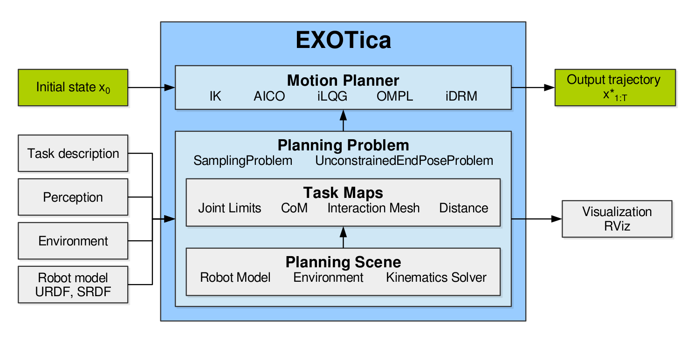

..  _overview:

****************
EXOTica overview
****************

The Extensible Optimization Toolset (EXOTica) is a framework of software tools designed for development and evaluation of motion synthesis algorithms within ROS. We will describe how to rapidly prototype new motion solvers that exploit a common problem definition and structure which facilitates benchmarking through modularity and encapsulation.
We will refer to several core concepts in robotics and motion planning throughout this chapter. These topics are well presented in robotics textbooks such as `Springer Handbook of Robotics <https://books.google.co.uk/books?id=Xpgi5gSuBxsC>`_ and `Planning Algorithms <http://planning.cs.uiuc.edu/>`_. This background material will help you to understand the area of research that motivated development of EXOTica. 

Our motivation to begin this work stems from the need to either implement new tools or to rely on existing software often designed for solving a problem other than the one we intended to study. The need to implement and test new ideas rapidly led us to the specification of a library that is modular and general while providing useful tools for motion  planning. A guiding principle hereby is to remove implementation-specific bias when prototyping and comparing algorithms, and hitherto create a library of solvers and problem formulations. 

.. image:: images/example.png
    :width: 30%
    :align: right

In this chapter, we will use a well-known algorithm as an example in order to explain how to use and extend the core components of EXOTica to explore novel formulations. 
Consider a robot arm mounted to a workbench (see picture). The arm consists of several revolute joints actuated by servo motors moving the links of the robot body. A gripper may be attached to the final link. The task is to compute a single configuration of the robot arm which will place the gripper at a desired grasping position - i.e. our example will follow the implementation of an inverse kinematics solver. Once the problem and motion solver have been implemented, we can compute the robot configuration using EXOTica with the following code:

.. code-block:: cpp

    #include <exotica_core/exotica_core.h>
    using namespace exotica;

    int main(int argc, char **argv)
    {
        MotionSolverPtr solver = XMLLoader::LoadSolver("{exotica_examples}/resources/configs/example_ik.xml");
        Eigen::MatrixXd solution;
        solver->Solve(solution);
    }

This snippet shows how little code is required to run a motion planning experiment. We load a motion solver and a problem definition from an example configuration file located in the ``exotica_examples`` package, allocate the output variable, and solve the problem using three lines of code. What this snippet does not show is the definition of the planning problem, the implementation of the algorithm and an array of other tools available in EXOTica. The running example will focus on motion planning. However, we view motion planning and control as two approaches to solving the same motion synthesis problem at different scales. For example, the problem could be viewed as an end-pose motion planning problem as well as operational space control, when executed in a loop. This allows us to formulate complex control problems as re-planning and vice versa. EXOTica provides the tools to implement such systems.

To motivate and explain the EXOTica software framework, we focus on how it can be used in research and prototyping. We will do this by describing how problems and solvers are defined, and the various tools they use.

System overview
===============

Prototyping of novel motion planning algorithms relies on defining mathematical models of the robotic system and its environment. To aid this process, EXOTica provides several abstractions and general interfaces that are used as components for building algorithms. The diagram above shows the three components central to algorithm design in EXOTica: (1) a ``planning scene``, providing tools to describe the state of the robot and the environment, (2) a ``planning problem`` formally defining the task, and (3) a ``motion solver``. These abstractions allow us to separate problem definitions from solvers. In particular, motion solvers implement algorithms such as `AICO <http://doi.acm.org/10.1145/1553374.1553508>`_ and `RRTConnect <https://ieeexplore.ieee.org/document/844730>`_. These implementations may perform trajectory optimization, randomized sampling, or any other computation which requires a very specific problem formulation.

How the problem is formulated is fully contained within the definition of a ``planning problem``. Each algorithm solves exactly one type of motion planning problem while one type of problem may be compatible with multiple solvers. As a result, several algorithms can be benchmarked on the exact same problem. When benchmarking two algorithms that are compatible with different types of problems, the problems have to be converted explicitly. This is a useful feature that makes it easy to track differences between problem formulations that are intended to describe the same task. 

All planning problems use the ``task maps`` as components to build cost functions, constraints, or validity checking criteria. Task maps perform useful computations such as forward kinematics, center-of-mass position calculation, and joint limit violation error computation. To further support the extensibility of EXOTica, the motion solvers and the task maps are loaded into EXOTica as plug-ins. As such, they can be developed separately and loaded on demand. One such example is the plug-in which wraps the sampling-based algorithms implemented in the `OMPL library <http://ompl.kavrakilab.org>`_.

The diagram above also shows the `planning scene` which separates the computation of kinematics from the computation of task related quantities.

System model
============
To synthesize motion, we describe the system consisting of the robot and its environment using a mathematical model. This system model may be kinematic or it may include dynamic properties and constraints. EXOTica uses the system model to evaluate the state using tools implemented inside the ``planning scene``. The system diagram shows the ``planning scene`` as a part of the planning problem where it performs several computations required for evaluating the problem.

.._overview-planning-scene:
Planning scene
--------------
The ``planning scene`` implements the tools for updating and managing the robot model and the environment. The robot model is represented by a kinematic tree which stores both the kinematic and dynamic properties of the robot, e.g., link masses and shapes, joint definitions, etc. The environment is a collection of additional models that are not part of the robot tree but that may interact with the robot. The environment may contain reference frames, other simplified models (geometric shapes), and real sensor data based representations such as pointclouds and `OctoMaps <http://octomap.github.com>`_. The planning scene implements algorithms for managing the objects in the environment (e.g. adding/removing obstacles) as well as computing forward kinematics and forward dynamics.

The system is parametrized by a set of variables that correspond to controllable elements, e.g. the robot joints. The full state of the system is described using these variables and we will refer to it as the ``robot state``. In some cases, only a subset of the robot state is controlled. We call this subset the ``joint group``. Analogous to the `MoveIt! <https://moveit.ros.org/>`_ definition of a move group, a joint group is a selection of controlled variables used for planning or control. From now on, whenever we refer to a joint state, we are referring to the state of the joint group.

The system model may be kinematic, kino-dynamic, or fully dynamic. The robot state is then described by joint positions, joint positions and velocities, or full system dynamics respectively. The system dynamics may be provided via a physics simulator. We will only consider the kinematic model for simplicity.

The system model is implemented as a tree structure mimicking the structure implemented in the `KDL library <http://www.orocos.org/kdl>`_. The diagram below illustrates the kinematic tree of a planar robot arm. 

.. image:: images/kinematic_tree.png
    :width: 100%
    :align: center

The planning scene stores the kinematic tree composed of the robot model and the environment. The diagram shows a robot model which has two revolute joints :math:`J_1` and :math:`J_2` defined by joint angles :math:`\theta_1` and :math:`\theta_2` respectively, a base frame and an end effector frame :math:`A`. A grasping target is located at frame :math:`B`. The root of the tree is at the world frame. The grasping task can exploit the relative transformation :math:`M_A^B`.

Every node in the tree has one parent and possibly multiple children. The node defines a spatial transformation from the tip frame of the parent node to its own tip frame. Every node consists of a position offset of the joint, a joint transformation, and a tip frame transformation (see the `KDL documentation <http://www.orocos.org/kdl>`_). The joint transformation is constant for fixed joints. The transformations of all joints that belong to the controlled ``joint group`` are updated based on the joint state. During the update, the local transformation of the node is updated and the transformation of the tip w.r.t. the world frame is accumulated. The nodes of the tree are updated in a topological order (from the root to the leafs). This ensures that the tip frame of the parent node is always updated before its children.

The EXOTica ``Scene`` implements a method for publishing the frames to `RViz <http://wiki.ros.org/rviz>`_ using `tf <http://wiki.ros.org/tf2>`_ for debugging purposes. These frames can be visualized using the `tf <http://wiki.ros.org/tf2>`_ and the ``RobotModel`` plug-ins.

The system model provides an interface to answer kinematic queries. A query can be submitted to the ``Scene``, requesting arbitrary frame transformations. Each requested frame has the following format:

 - Name of the tip frame (Frame A)
 - Offset of the tip frame
 - Name of the base frame (Frame B)
 - Offset of the base frame

The diagram above illustrates an example scene. Any existing frame can be used to define a base or a tip frame of a relative transformation.
The response to the query will then contain a transformation of the tip frame with respect to the base frame. If an offset is specified, each respective frame will be redefined to include the offset. If a base frame is not specified, the world frame will be used by default. Since all transformations of the tree nodes w.r.t. the world frame have been computed during the update, the query computation only adds the tip frame to the inverted base frame :math:`$M_A^B={M_B^{world}}^{-1}M_A^{world}`. 
We use the following notation: the subscript and superscript denote tip and base frames respectively. :math:`M_A^B` reads: transformation of frame :math:`A` w.r.t. frame :math:`B`.}

The ``Scene`` has been designed to answer a large number of requests in batches. While some smaller problems, such as simple kinematic chains, may be more costly to update, larger kinematic trees with a large number of leaf nodes are handled more efficiently by simply iterating over the requested frames.MoveIt!

The system model also computes derivatives of the spatial frames w.r.t. the control variables. These are computed as geometric Jacobians (:math:`J`) and Jacobian derivatives (:math:`\dot{J}`). The Jacobian has six rows and a number of columns corresponding to the number of controlled joints. Each column represents a spatial velocity in form of a ``twist``. The twist :math:`^Bt^i_A` describes the linear and angular rate of motion of the tip frame :math:`A` w.r.t. the joint frame :math:`i` expressed in the base frame :math:`B`. We use the notation with the ``expressed in frame`` in the left superscript. Using the twist representation allows us to correctly compute spatial transformations using the `Lie group algebra <http://ingmec.ual.es/~jlblanco/papers/jlblanco2010geometry3D_techrep.pdf>`_.

The kinematic tree represents the robot kinematic model and the objects in the environment. The robot model can be loaded from a pair of `MoveIt! <https://moveit.ros.org/>`_ compatible URDF and SRDF files. The URDF file specifies the robot kinematics, joint transformations and range of motion, frame locations, mass properties and collision shapes. The SRDF file specifies the base of the robot (fixed, mobile, or floating), joint groups, and collision pairs. The robot configuration created for `MoveIt! <https://moveit.ros.org/>`_ is fully compatible with EXOTica. The ``Scene`` also implements an interface to populate the environment with collision objects from `MoveIt! <https://moveit.ros.org/>`_ planning scene messages and from `MoveIt! <https://moveit.ros.org/>`_ generated text files storing the scene objects. The ``Scene`` may load additional basic shape primitives, meshes, or `OctoMaps <http://octomap.github.com>`_. 

In order to perform collision checking, a ``CollisionScene`` can be loaded as a plug-in into a ``Scene``. This allows for different implementations of collision checking algorithms to be used as required and does not tie EXOTica to a particular collision checking library. For instance, by default, EXOTica ships with two ``CollisionScene`` implementations using the FCL library - one based on the stable FCL version also used in `MoveIt! <https://moveit.ros.org/>`_ and one tracking the development revision of FCL. The ``CollisionScene`` plug-ins may hereby implement solely binary collision checking, or additional contact information such as signed distance, contact (or nearest) points, as well as contact point normals. This information is captured and exposed in a so-called ``CollisionProxy``.

Referring back to the example inverse kinematics problem, the planning scene consists of the kinematics of the robot with a base link rigidly attached to the world frame. We choose to use a simplified version following the DH parameters of the KUKA LWR3 arm which we load from a pair of URDF and SRDF files. This robot has seven revolute joints. The joint group will consist of all seven joints as we intend to control all of them. We will not be performing collision checking in this experiment. The ``planning scene`` is initialized from an EXOTica XML configuration file. The XML file contains the following lines related to the setup of the ``planning scene``:

.. code-block:: xml

    <PlanningScene>
        <Scene>
            <JointGroup>arm</JointGroup>
            <URDF>{exotica_examples}/resources/robots/lwr_simplified.urdf</URDF>
            <SRDF>{exotica_examples}/resources/robots/lwr_simplified.srdf</SRDF>
        </Scene>
    </PlanningScene>

where the joint group parameter selects a joint group defined in the SRDF file by name. The robot model is loaded from the URDF and SRDF files specified here. When the paths are not specified, EXOTica attempts to load the robot model from the ``robot_description`` ROS parameter by default. EXOTica additionally allows to set ROS parameters for the planning robot description from specified file paths if desired.

The system model provides access to some general tools for computing kinematic and dynamic properties of the system. These tools have been designed for performing calculations for solving a wide variety of motion planning problems. The system modeling tools are generic but they can be ultimately replaced with a more specific set of kinematics and dynamics solvers in the final deployment of the algorithm. This is, however, outside of the scope of EXOTica.

Problem definition
==================
EXOTica was designed for prototyping and benchmarking motion synthesis algorithms. The main objective of our framework is to provide tools for constructing problems and prototyping solvers with ease. To do so, we first separate the definition of the problem from the implementation of the solver. Each problem consists of several standardized components which we refer to as ``task maps``.

.._overview-task-maps:
Task maps
---------
The core element of every problem defined within EXOTica is the function mapping from the configuration space (i.e. the problem state which captures the model state, a set of controlled and uncontrolled variables, and the state of the environment) to a task space. We call this function a ``task map``. For example, a task map computes the center-of-mass of the robot in the world frame. A task map is a mapping from the configuration space to an arbitrary task space. The task space is, in fact, defined by the output of this function.

The following task maps are implemented in EXOTica:

.. toctree::
    :maxdepth: 2
    :caption: Joint space task maps

    task_maps/joint_pose
    task_maps/joint_limits

.. toctree::
    :maxdepth: 2
    :caption: World space task maps

    task_maps/eff_frame
    task_maps/eff_position
    task_maps/eff_orientation
    task_maps/eff_distance

.. toctree::
    :maxdepth: 2
    :caption: Stability task maps

    task_maps/com

.. toctree::
    :maxdepth: 2
    :caption: Collision task maps

    task_maps/sphere_collision

.. toctree::
    :maxdepth: 2
    :caption: Alternate task maps

Undocumented:
 * ``JointVelocityLimit``
 * ``JointVelocityBackwardDifference``
 * ``JointJerkBackwardDifference``
 * ``JointAccelerationBackwardDifference``

 * ``EffVelocity``
 * ``LookAt``
 * ``EffAxisAlignment``
 * ``PointToLine``
 * ``PointToPlane``
 
 * ``QuasiStatic``

 * ``CollisionCheck``

 * ``InteractionMesh``

In our example, we use the ``end-effector position`` task map. The task space is therefore :math:`\Phi_\text{EffPos}(\boldsymbol{x})\in\mathbb{R}^3`. The task map is loaded from the XML file. The following lines of the XML configuration file correspond to the task map definition:

.. code-block:: xml

    <Maps>
        <EffPosition Name="Position">
            <EndEffector>
                <Frame Link="lwr_arm_7_link" BaseOffset="0.5 0 0.5 0 0 0 1"/>
            </EndEffector>
        </EffPosition>
    </Maps>

where the only parameter of the task map is a single relative spatial frame. This frame defines the translation of the seventh robot link relative to the coordinates :math:`(0.5, 0, 0.5)` in the world frame. If no frame is specified, world frame is assumed by default. If a relative offset is not specified, an identity transformation offset is assumed. This example is only intended to compute inverse kinematics, we have therefore chosen to only minimize the end-effector position error. However, an arbitrary number of cost terms can be added by adding multiple task maps to this problem definition. For instance, we could easily add another task map to constrain the orientation of the end-effector.

The output of a single task map is a segment of the ``task space vector``. For more information read the section on :ref:`task_space_vector`. The input of a task map is the states of the robot model and environment as well as the arbitrary number of frame transformations required for the calculations. These are computed using the ``planning scene``. The task map implements the mapping within its ``update`` method. This method has 3 different overloads depending on what order of derivative is requested: a) no derivative (e.g. in sampling), b) first-order derivatives (e.g. Jacobian used in gradient descent), and c) second-order derivatives. Not all overloads have to be defined, i.e. a collision checking task map may only detect collisions but it will not provide any gradients (derivatives). We exploit this for fast collision checking for `sampling-based solvers <http://planning.cs.uiuc.edu/>`_.

The task map will update the task space vector and its derivatives when the solver requires it. These updates are normally triggered by the solver and they do not have to be called manually. This also ensures that the ``task space vector`` is updated correctly. The collection of task maps is therefore central to formally defining motion planning problems. How the output of the task map is used then depends on the type of the planning problem.

Planning problems
=================

A ``planning problem`` within EXOTica represents a specific formulation of a motion planning problem. Since every formulation has very specific advantages for a particular type of application, the formulations may vary significantly. To provide a unified framework, we identify several categories of common features of different types of problems.

.. toctree::
    :maxdepth: 2
    :caption: EXOTica planning problems

    problems/unconstrained_end_pose_problem
    problems/unconstrained_time_indexed_problem
    problems/sampling_problem

Undocumented:
 * ``EndPoseProblem``
 * ``BoundedEndPoseProblem``
 * ``TimeIndexedProblem``
 * ``BoundedTimeIndexedProblem``
 * ``TimeIndexedSamplingProblem``

Depending on how the system is modeled, we distinguish: a) kinematic, b) kino-dynamic, and c) dynamic systems. We then categorize the problem based on the ``state representation`` required by these types of systems: position :math:`(\boldsymbol{x})`, position and velocity :math:`(\boldsymbol{x}, \dot{\boldsymbol{x}})`, and the full dynamic state :math:`(\boldsymbol{x}, \dot{\boldsymbol{x}}, \ddot{\boldsymbol{x}}, \boldsymbol{\tau}, \boldsymbol{F})` where the variables denote positions, velocities, accelerations, joint torques, and external forces respectively.
We then distinguish between ``planning spaces``: a) configuration space, and b) task space (e.g. end-effector position and orientation). These categories define how the state of the the system is stored. This affects both memory layout and the format of the input to the solver (e.g. the start state has to include joint positions and velocities).

Furthermore, we categorize the problem based on the type of the output. The ``output type`` may include: a) single configuration (e.g. output of a inverse kinematics solver), b) a time-indexed trajectory (e.g. output of trajectory optimization), or c) non-time indexed trajectory (e.g. output of a sampling-based solver). Other types and subtypes of problems do exist. A time-indexed trajectory may have fixed or variable number of time steps or a variable timing between steps.

EXOTica uses a problem naming system based on this categorization. The names are constructed based on the four main categories: ``planning space``, ``problem type``, ``state representation`` and the ``output type``. The table below shows how the name is constructed. To achieve brevity, each category has a default type. The default types are ``configuration space``, ``sampling``, ``kinematic``, ``non-time indexed trajectory`` respectively for each category in this table. When the problem falls within the default type for a category, this type is omitted from the name. For example, a problem of type ``SamplingProblem`` is referring to a configuration space sampling problem using a kinematic robot model and returning a non-time indexed trajectory.

+-------------+-------------------+-------------------+-----------------+
| Planning    | Problem           | State             | Output          |
| space       | type              | representation    | type            |
+=============+===================+===================+=================+
| *CSpace*    | **Unconstrained** | *Kinematic*       | **EndPose**     |
+-------------+-------------------+-------------------+-----------------+
| *CSpace*    | **Unconstrained** | *Kinematic*       | **TimeIndexed** |
+-------------+-------------------+-------------------+-----------------+
| *CSpace*    | **Sampling**      | *Kinematic*       | *NonIndexed*    |
+-------------+-------------------+-------------------+-----------------+
| *CSpace*    | **NLP**           | **Dynamic**       | **TimeIndexed** |
+-------------+-------------------+-------------------+-----------------+

Motion solvers
==============

The structure of a planning problem within EXOTica allows us to formally define an interface for solving specific types of problems. The motion solver then takes the problem instance as input and computes the solution. How this computation is performed depends entirely on the implementation of the solver. EXOTica offers several built-in solvers.

.. toctree::
    :maxdepth: 2
    :caption: EXOTica solvers

Undocumented:
 * ``AICOSolver``
 * ``IKSolver``
 * ``LevenbergMarquardtSolver``
 * ``OMPLSolver``
 * ``TimeIndexedRRTConnectSolver``

In our example, we created a system model and an unconstrained end-pose problem that uses this system model. We will now use our implementation of the inverse kinematics solver to compute the solution. The following XML configures the IK solver:

.. code-block:: xml

    <IKSolver Name="MySolver">
        <MaxIterations>1</MaxIterations>
    </IKSolver>

EXOTica was designed for development of new motion planning algorithms and for running benchmarks. The solver in our example can be easily changed by editing the XML file or from code. 
